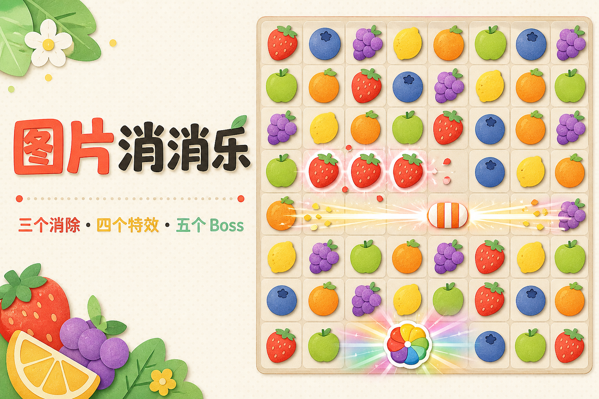

<p align="center">
  
</p>

<h1 align="center">奶龙消消乐</h1>

<p align="center">把喜欢的照片变成棋子，创建自己的八行八列三消游戏。</p>

<p align="center">
  <a href="https://github.com/xyma2003/match3/actions/workflows/ci.yml">
    
  </a>
</p>

> 在线试玩的稳定域名正在配置中。EdgeOne 默认预览链接会过期，因此不在这里保存临时地址。

## 功能亮点

- 上传 5 张普通图片和 1 张 Boss 图片，自定义游戏名称和棋子
- 三连消除、四连横向/纵向特效、L/T 型交叉特效和五连 Boss
- 连消、下落动画和无解棋盘自动洗牌
- 无限关卡，每五关进入困难模式
- 游客本地进度，以及登录后的多游戏和云端关卡记录
- 适配桌面和移动端，支持点击、触控与滑动交换

## 技术栈

- Next.js 16、React 19、TypeScript
- 腾讯云 EdgeOne Pages（Makers）
- EdgeOne Pages Blob：账号、会话、游戏进度和用户图片
- ESLint、GitHub Actions 和 Dependabot

## 本地运行

需要 Node.js 22.13 或更高版本。

```bash
npm install
npm run dev
```

提交前运行完整检查：

```bash
npm test
npm audit --omit=dev
```

`npm test` 会依次执行 lint、TypeScript 检查和正式构建。

## 云端数据与隐私

- 游客的关卡进度保存在当前浏览器，游客上传的图片不会发送到服务器。
- 登录账号的密码只保存 PBKDF2 哈希和随机盐；新注册流程不收集找回邮箱。
- 登录后的游戏进度和图片保存在名为 `nailong-match3` 的 EdgeOne Pages Blob 存储中。
- 云端图片接口需要有效登录会话，并只允许用户读取自己账号下的图片。
- 重新上传一组图片后，服务端会清理这组图片之前引用的 Blob，减少无效存储占用。

实际账号记录、密码哈希、游戏进度和用户上传图片都不会提交到 Git 仓库。

## 项目结构

```text
app/
├── api/                 # 登录、游戏记录和图片接口
├── lib/                 # 会话、密码与 EdgeOne Blob 封装
├── globals.css          # 页面布局、棋盘与动画样式
└── page.tsx             # 游戏规则、交互与账号界面
public/
├── defaults/            # 默认棋子图片
└── og-match3.png        # README 与社交分享封面
.github/
├── workflows/ci.yml     # 自动 lint、审计与生产构建
└── dependabot.yml       # 定期检查依赖更新
edgeone.json             # EdgeOne Node.js 运行时版本
```

## 部署

当前线上版本部署在腾讯云 EdgeOne Pages（Makers），代码来源为
[`xyma2003/match3`](https://github.com/xyma2003/match3) 的 `main` 分支。

### EdgeOne Pages 部署步骤

1. 在 EdgeOne Pages（Makers）中选择“导入 Git 仓库”。
2. 连接 GitHub，并选择 `xyma2003/match3`。
3. 将生产分支设为 `main`，项目根目录保持为仓库根目录。
4. 使用 `npm install` 安装依赖，并用 `npm run build` 执行正式构建。
5. 部署完成后，在部署记录中生成预览链接进行验证。

项目通过 [`edgeone.json`](edgeone.json) 固定使用 Node.js 22.17.1。部署时不需要额外配置数据库连接；
首次写入时会自动使用项目的 EdgeOne Pages Blob 存储。

EdgeOne 生成的默认预览链接有有效期，只适合临时测试。长期分享需要在项目的“域名管理”中绑定配置完成的自定义域名，
例如 `game.goafield.cn`。绑定域名不会改变 GitHub 仓库或构建流程。

## 自动维护

- 每次推送到 `main` 或创建 Pull Request 时，GitHub Actions 会自动运行生产依赖审计、lint 和构建。
- Dependabot 每周检查 npm 依赖、每月检查 GitHub Actions 版本，并通过 Pull Request 提交更新建议。
